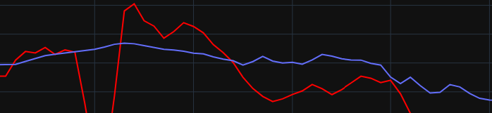

# Análisis Exploratorio de Datos (EDA) sobre población china
El presente EDA trata sobre la población china y la intervención estatal en la generación de problemas actuales como el envejecimiento de la población y la desproporción entre hombres y mujeres.

## Objetivos del EDA 
- Analizar los patrones y tendencias de la población china en el último siglo.
- Estudiar su relación con la política estatal y la cultura.
- Plantear futuras líneas de estudio u oportunidades a explorar.

## Hipótesis:
1) La injerencia estatal en materia de control poblacional es negativa en este caso.
2) El envejecimiento poblacional es un problema más difícil de corregir que la desproporción de género en términos de tiempo. 

## Contenido:
Este análisis ha sido realizado utilizando datos públicos de fuentes confiables como el Banco Mundial y de otras fuentes especializadas como [Our World in Data](https://ourworldindata.org/). El análisis se divide en cuatro secciones principales:

1) Introducción y contexto:
La situación poblacional actual viene marcada por las políticas relacionadas en el siglo XX asociadas a las preferencias culturales: primer natalismo de Mao y rápido crecimiento poblacional y posteriormente control de la natalidad.

2) Planteamiento de hipótesis.

3) Exploración de los datos en relación a sus políticas estatales:
Aquí exploramos los cambios en la población china en las últimas décadas y su composición por edad y género. Se utilizaron gráficos y visualizaciones para mostrar los patrones de crecimiento, la distribución de edades y la proporción de hombres y mujeres en la población. En particular, se destaca la política del Hijo Único y su impacto en la estructura de la sociedad.

1) Problemas actuales:
En esta sección se destacan dos problemas actuales importantes relacionados con la intervención estatal en la población china. En primer lugar, el envejecimiento de la población, que es un problema grave debido a la baja tasa de natalidad y el aumento de la esperanza de vida. En segundo lugar, la desproporción entre hombres y mujeres debido a la política del hijo único, que ha llevado a un desequilibrio forzoso en la proporción de género en la población y plantea problemas sociales y económicos.

## Apéndices

### Futuras líneas de estudio:
El estudio de la población permite que se abra una miríada de posibilidades para investigaciones futuras. En nuestro caso de estudio, creemos que se puede continuar la investigación en torno a cuestiones como:

    - Proyecciones sobre la fuerza y estructura laboral en el futuro. ¿Aumento de costes laborales y reducción de la competitividad?
    - Viabilidad del sistema de pensiones.
    - Estrés social en un entorno de competencia por la desproporción en el número de hombres por mujer.
    - Límite de la demanda interna.
    - Densidad poblacional completamente asimétrica en los ejes campo/ciudad y costa/interior.
    - Inmigración interna, sistema hukou.

### Oportunidades:
Tener conocimiento sobre las tendencias poblacionales de un país puede ser un factor importante a la hora de que las empresas interesadas desarrollen sus estrategias de negocio o que los particulares planteen en qué sectores invertir sus ahorros de cara al largo plazo. Algunos sectores que consideramos que pueden cobrar importancia en una población envejecida y con baja tasa de natalidad pueden ser los siguientes:

    - Residencias y servicios de salud.
    - Sector farma.
    - Turismo especializado.
    - Bienes de consumo orientados a esta parte de la población (ejemplo: pañales)
    - Alimentos saludables, suplementos alimenticios.
    - Automatización frente a la menor cantidad de mano de obra.
    - Servicios financieros más comunes en inversores de edad avanzada (plazo fijo).

